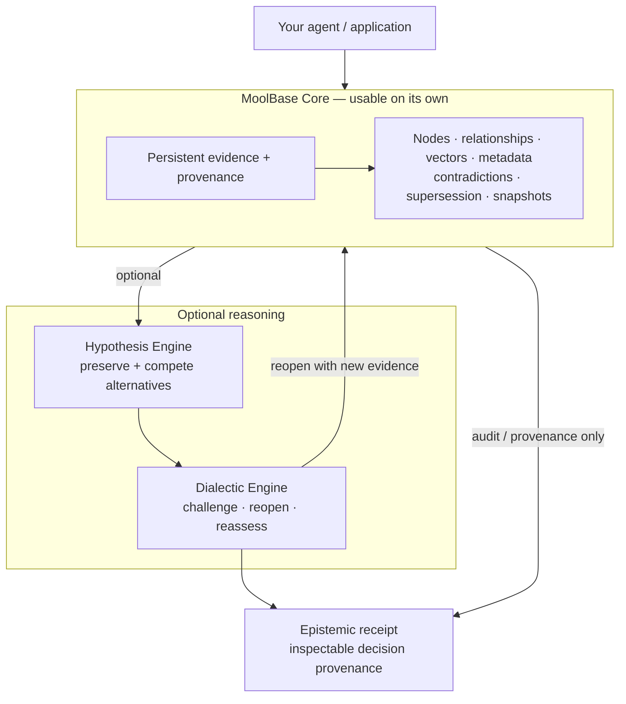

# MoolBase by RASVAI

**A persistent evidence and provenance database for AI agents — with optional reasoning when you need it.**

[](https://github.com/rastogivaibhav/graphenedb_v1/actions/workflows/ci.yml)
[](https://github.com/rastogivaibhav/graphenedb_v1/actions/workflows/alpha-release-gate.yml)
[](LICENSE)

**Store what your agent knows, where it came from, what conflicts with it, and how that state changes over time.**

You can use **MoolBase Core** as a database on its own.

When the application needs more, add:

- **Hypothesis Engine** — preserve and compete alternative explanations.
- **Dialectic Engine** — challenge a current decision and reopen it when evidence changes.
- **Epistemic Receipts** — keep an inspectable record of the evidence and revision path.

You do **not** need to adopt the reasoning stack to use the database.

**Status:** developer alpha for research and controlled pilots. Not enterprise GA and not a semantic truth engine.

> **Naming:** MoolBase is the provisional public product identity for the system historically developed as **GrapheneDB**. Existing APIs, benchmark hashes, receipts, papers and implementation identifiers retain their historical names during migration. See [ADR-0001](docs/adr/0001-moolbase-public-product-identity.md).

**Start here:** [See database examples](#what-can-you-build-with-moolbase-core) · [Build](#build-from-source) · [Optional reasoning](#optional-reasoning) · [Run the proof](#run-the-proof) · [Docs](#documentation)

---

## Why MoolBase Core

A normal database can persist records.

An agent-memory system can retrieve useful context.

MoolBase Core is designed to persist **evidence-aware state**:

- the observation or claim;
- where it came from;
- how it relates to other evidence;
- whether another item supports, contradicts or supersedes it;
- vector and metadata representations;
- snapshots and history;
- causal/graph relationships;
- the context needed to explain why something was retrieved.

The core database can already be useful without any hypothesis or dialectic reasoning.

### Familiar database mental model

```text
Your agent / application
        │
        ├── put_node(...)
        ├── put_edge(...)
        ├── put_extraction(...)
        │
        ├── vector_search(...)
        ├── metadata_search(...)
        ├── causal_search(...)
        │
        ├── get_node(...)
        ├── get_edge(...)
        └── snapshot(...)
                │
                ▼
        ┌─────────────────────┐
        │    MoolBase Core    │
        │                     │
        │ Evidence / nodes    │
        │ Relationships       │
        │ Vectors + metadata  │
        │ Provenance          │
        │ Contradictions      │
        │ Supersession        │
        │ Snapshots / history │
        └─────────────────────┘
```

The current implementation API still uses the historical C++ name `GrapheneDB`.

---

## What can you build with MoolBase Core?

These examples already exist in the repository and use the database directly.

### 1. Incident memory with root-cause provenance

Store an incident symptom and the observed root cause that explains it:

```cpp
db.put_node(NodeInput{
    "Root cause: ingress timeout dropped from 30s to 3s.",
    {0.9f, 0.1f, 0.0f},
    sig,
    1182,
    true,
    false,
    false,
    {{"type", "root_cause"}, {"service", "gateway"}}
}, &root);

db.put_node(NodeInput{
    "Symptom: API timeout spike after release 2.3.",
    {0.1f, 0.9f, 0.0f},
    sig,
    1182,
    false,
    true,
    false,
    {{"type", "incident"}, {"service", "gateway"}}
}, &symptom);

db.put_edge(EdgeInput{
    root,
    symptom,
    EdgeOrigin::Observed,
    EdgeRole::Causal,
    0.94,
    {{"source", "postmortem"}}
});

auto result = db.causal_search(
    {0.1f, 0.92f, 0.0f},
    sig,
    QueryMode::Empirical);
```

This lets an operations agent retrieve **not only a similar incident**, but the causal path and provenance that connected the symptom to the root cause.

See [`api_incident_memory.cpp`](examples/api_incident_memory.cpp).

---

### 2. Keep contradictions instead of overwriting history

A current explanation can contradict an older hypothesis without deleting it:

```cpp
db.put_edge(EdgeInput{
    root,
    stale_hypothesis,
    EdgeOrigin::Observed,
    EdgeRole::Contradicts,
    0.90,
    {{"source", "postmortem"}}
});

db.put_edge(EdgeInput{
    current_action,
    stale_hypothesis,
    EdgeOrigin::Observed,
    EdgeRole::Supersedes,
    0.92,
    {{"source", "decision-log"}}
});

auto current = db.metadata_search("status", "current");
auto old     = db.metadata_search("status", "superseded");
```

The old state remains inspectable, but the database records that it was contradicted and superseded.

See [`api_contradiction_supersession.cpp`](examples/api_contradiction_supersession.cpp).

---

### 3. Give a coding agent architectural memory

Store an ADR and connect it to the production failure that motivated it:

```text
ADR-007
"split checkout pricing module"
        │
        │ caused by / explains
        ▼
BUG-331
"retry storm when pricing call exceeded 600 ms"
```

The coding agent can later retrieve **why the architecture changed**, rather than only remembering the latest code structure.

See [`api_coding_memory.cpp`](examples/api_coding_memory.cpp).

---

### 4. Build a persistent team decision brain

Store customer context, a current decision and the decision it replaced:

```text
Customer context
"parents need controlled AI tutor mode"
        │
        ▼
Current decision
"ship parent-led practice first"
        │
        └── supersedes ──►
              Old decision
              "allow unrestricted chat in v1"
```

Then query only the current decisions:

```cpp
auto current_decisions =
    db.metadata_search("status", "current");
```

This gives an agent or team tool a decision history without flattening old and new decisions into one summary.

See [`api_team_brain.cpp`](examples/api_team_brain.cpp).

---

### More database examples

The [`examples/`](examples/) directory also covers:

- vector + graph causal retrieval;
- lattice-backed memory;
- contradiction and supersession;
- incident memory;
- coding-agent memory;
- team/shared memory.

Run the full example set with:

```bash
./scripts/build_release.sh
./scripts/run_examples.sh
```

See [`examples/README.md`](examples/README.md).

---

## Optional reasoning

MoolBase Core is the foundation. The reasoning capabilities sit **on top**.



### Adoption levels

| Use only what you need | What it gives you |
|---|---|
| **MoolBase Core** | persistent evidence, provenance, graph/vector/metadata search, contradictions, supersession and snapshots |
| **+ Receipts / audit** | inspectable evidence and decision provenance |
| **+ Hypothesis Engine** | multiple plausible explanations remain explicit |
| **+ Dialectic Engine** | challenge, reopen and revise a governed decision when the evidence warrants it |

This progressive model is intentional. A developer can stop at the database layer.

### When the full reasoning loop is enabled

```text
Evidence + provenance
        ↓
MoolBase Core
        ↓
Evidence bundle / verification / admissibility
        ↓
Hypothesis Engine
        ↓
Initial governed convergence or abstention
        ↓
Dialectic Engine
        ↓
   Reopen needed?
     ↙       ↘
   No         Yes
   ↓           ↓
Terminal    targeted evidence expansion
state          ↓
   ↑        MoolBase Core
   └───────────┘
        ↓
Epistemic receipt
```

The observable event sequence can include:

```text
HypothesisSet → Decision → Challenge → Reopen → Revision → Terminal
```

This is decision provenance, not persisted private model chain-of-thought.

Historical implementation names remain **GrapheneDB**, **HypoKosh** and **Dialectical Model Worlds (DWM)**.

---

## Developer interaction surfaces

| Layer | What you can do today | Current surfaces |
|---|---|---|
| **Database** | open the store, ingest evidence, query vectors/metadata/lattice/causal memory, inspect and validate | C++ `GrapheneDB`; limited C API; HTTP/Python ingest + search |
| **Reasoning** | generate hypotheses, run governed reasoning, invoke challenge/reopen | C++ `HypoKoshEngine`; `CompleteHypoKoshRuntime`; CLI; HTTP/Python reasoning |
| **Control** | configure retrieval/reasoning bounds, verification and capability switches | `RuntimeOptions`; `DialecticOptions`; `PathVerifier` |
| **Audit + state** | build receipts, inspect event history, persist/audit world state, validate provenance and back up | `CompactEpistemicReceipt`; `ModelWorld`; admin/validation surfaces |

The C++ API is currently the richest integration surface.

---

## Build from source

```bash
cmake -S . -B build \
  -DCMAKE_BUILD_TYPE=Release \
  -DGRAPHENEDB_BUILD_TESTS=ON \
  -DGRAPHENEDB_BUILD_SERVER=OFF \
  -DGRAPHENEDB_BUILD_BENCH=ON \
  -DGRAPHENEDB_BUILD_EXAMPLES=ON

cmake --build build -j2
ctest --test-dir build --output-on-failure
```

The historical `GRAPHENEDB_*` build options and namespaces remain intentionally stable during the naming transition.

For the packaged alpha path, see [Developer quickstart](docs/DEVELOPER_QUICKSTART.md).

---

## Minimal API

### C++ database

```cpp
#include "graphene/db.hpp"

graphene::GrapheneDB db;
graphene::DBOptions options;
options.dimension = 16;

auto status = db.open("/tmp/moolbase", options);
```

### Optional governed reasoning

```cpp
#include "graphene/hypokosh_runtime.hpp"

graphene::CompleteHypoKoshRuntime runtime(db);
graphene::RuntimeOptions options;

auto result = runtime.reason(query, signature, options);
```

### Python / HTTP

```python
from graphenedb_client import GrapheneDBClient

client = GrapheneDBClient(api_key="development-key")

client.put_node(
    "deployment introduced a memory leak",
    source="incident-review",
)

print(client.search("memory leak after deployment").data)
```

---

## Run the proof

If you want to evaluate the reasoning mechanism rather than only the database API:

```bash
git clone https://github.com/rastogivaibhav/graphenedb_v1.git
cd graphenedb_v1
python3 scripts/run_flagship_perturbations_v1.py
```

This rebuilds and replays the frozen flagship proof, verifies its canonical mechanism receipt, runs five pre-registered adversarial perturbations and writes machine-readable receipts.

**No hosted model or API key is required.**

Canonical flagship mechanism receipt:

```text
36ca5817494325870b81dbe96c261086c13ff09e040b7604242bcbf92d6dedef
```

See [Independent flagship reproduction](docs/INDEPENDENT_REPRODUCTION.md).

---

## Evidence and validation

Current reproducibility includes:

- frozen flagship proof + adversarial perturbations;
- exact-head CI and alpha-release gates;
- controlled intervention benchmarks;
- paper/system conformance checks;
- installed-package consumer tests;
- distribution integrity, checksums and SPDX 2.3 SBOM generation.

The current scientific programme is implementing an architecture ablation:

```text
B0  baseline
G0  MoolBase Core
G1  + Hypothesis Engine
G2  + Dialectic Engine
```

The score lock remains closed until the production execution boundaries and clean UNSCORED runs are proven.

See [MoolBase Lab & Market Program](https://github.com/rastogivaibhav/graphenedb_v1/issues/25).

---

## Maturity and limitations

**Developer alpha.**

Current limitations include:

- G0/G1/G2 production ablation is still being completed;
- structural stability is not semantic truth;
- no global asymptotic-stability proof exists for an unbounded model world;
- generic parsing is bounded and is not general natural-language understanding;
- public API surfaces still need further consolidation;
- long-duration production-hardware soak remains open;
- MoolBase domain/package migration is not final;
- independent reproductions and adopters are still required before GA claims.

---

## Documentation

- [Examples](examples/README.md)
- [Developer quickstart](docs/DEVELOPER_QUICKSTART.md)
- [Independent reproduction guide](docs/INDEPENDENT_REPRODUCTION.md)
- [Reasoning modes and receipts](docs/REASONING_MODES_AND_RECEIPTS.md)
- [Distribution security](docs/DISTRIBUTION_SECURITY.md)
- [Naming ADR — MoolBase public product identity](docs/adr/0001-moolbase-public-product-identity.md)
- [Agent Memory Is Not Enough](docs/articles/agent-memory-is-not-enough.md)
- [Changelog](CHANGELOG.md)
- [Support](SUPPORT.md)
- [Code of Conduct](CODE_OF_CONDUCT.md)

---

## Contribute or challenge it

The most valuable contribution right now is an **independent reproduction, failure case, adversarial scenario or credible criticism**.

- Read [CONTRIBUTING.md](CONTRIBUTING.md) and [CODE_OF_CONDUCT.md](CODE_OF_CONDUCT.md).
- For setup or usage help, see [SUPPORT.md](SUPPORT.md).
- Reproduce the [flagship proof](docs/INDEPENDENT_REPRODUCTION.md).
- Submit a failure case or technical critique through [GitHub Issues](https://github.com/rastogivaibhav/graphenedb_v1/issues).
- See the [public reproduction request](https://github.com/rastogivaibhav/graphenedb_v1/issues/38).

For security vulnerabilities, follow [SECURITY.md](SECURITY.md) rather than opening a public issue.

---

## Citation

If you use MoolBase/GrapheneDB in research, see [CITATION.cff](CITATION.cff).

## Maintainer

Maintained by [@rastogivaibhav](https://github.com/rastogivaibhav).

## License

Apache-2.0. See [LICENSE](LICENSE), [NOTICE](NOTICE) and [THIRD_PARTY_NOTICES.md](THIRD_PARTY_NOTICES.md).

---

**MoolBase by RASVAI** — *Store the evidence. Preserve the alternatives. Know why belief changed.*
