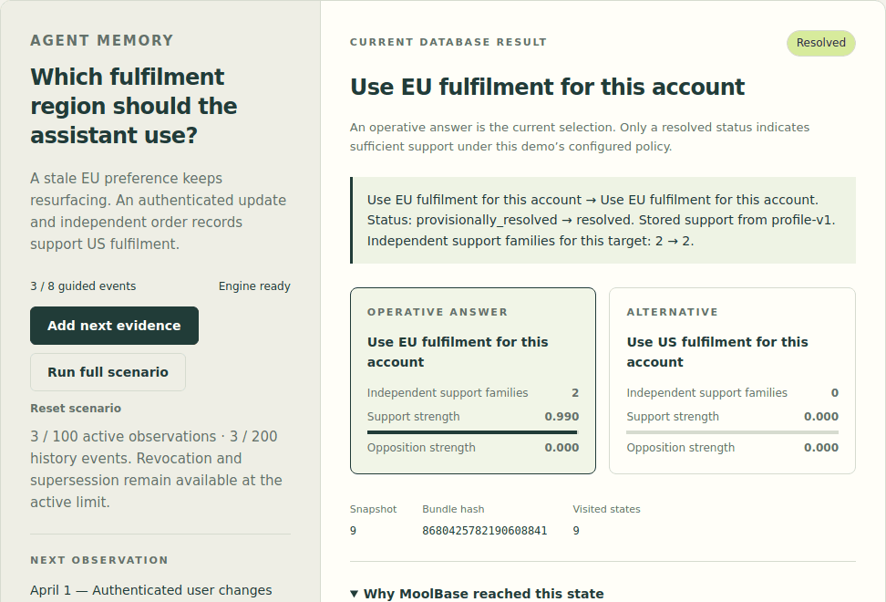
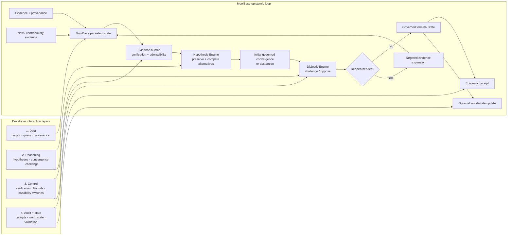

# MoolBase by RASVAI

**Evidence-aware memory for agents whose answers must change when the evidence changes.**

MoolBase keeps observations, competing explanations and an inspectable record of why a decision changed. Its embedded C++20 database stores nodes with content, vectors and provenance metadata, connected by typed relationships. Optional reasoning layers expose alternatives, opposition and decision receipts. Try a customer-memory correction before exploring the architecture.

**Released:** [v0.6.0-alpha.2 — developer preview](https://github.com/rastogivaibhav/MoolBase/releases/tag/v0.6.0-alpha.2). Download the Linux package or self-contained source examples, with checksums, manifests and SPDX inventories.

**Start:** [See the answer change](#see-the-answer-change) · [Run your first application](#your-first-application) · [Evidence Lab](https://moolbase.rasvai.com) (public; no sign-in required) · [Versioned Python examples](https://github.com/rastogivaibhav/MoolBase/tree/v0.6.0-alpha.2/examples/customer_showcase) · [Developer and agent guide](docs/AGENT_INTEGRATION.md)

Use the `v0.6.0-alpha.2` release tag for the runnable customer workflows. The default branch also carries the research programme.

[](https://github.com/rastogivaibhav/MoolBase/actions/workflows/ci.yml)
[](https://github.com/rastogivaibhav/MoolBase/actions/workflows/alpha-release-gate.yml)
[](LICENSE)

**Store the evidence. Preserve the alternatives. Know why belief changed.**

### Full stack at a glance

MoolBase combines a persistent evidence database with deterministic reasoning structures rather than treating agent memory as a single retrieval layer:

- **MoolBase Core** — embedded C++20 storage for evidence, vectors, provenance, typed causal relationships, WAL/checkpoint durability, validation and versioned state. Historical package/API names remain `GrapheneDB` / `graphene`.
- **Dense hexagonal lattice topology** — durable axial `q/r/layer` coordinates, validated same-layer and cross-layer bonds, deterministic placement and optional lattice-aware retrieval. It is a database topology/retrieval primitive, not a material-science simulator.
- **FiberBundle** — a deterministic, hashable projection of evidence paths grouped by target, role and lineage, designed to distinguish raw path multiplicity from genuinely independent support.
- **HypoKosh / Hypothesis Engine** — preserves and competes alternative hypotheses, performs governed convergence or abstention, and emits inspectable hypothesis/decision events.
- **DWM / Dialectic Engine** — applies material opposition, challenge, bounded reopen/re-expansion and governed revision/synthesis when the evidence process warrants it.
- **Epistemic receipts** — compact machine-readable provenance for status, evidence families, selected paths, contradiction, reopen/revision and terminal state.

Conceptually:

```text
Evidence
  ↓
MoolBase Core + dense hexagonal lattice
  ↓
FiberBundle
  ↓
HypoKosh / Hypothesis Engine
  ↓
DWM / Dialectic Engine
  ↓
Decision / Reopen / Revision
  ↓
Inspectable epistemic receipt
```

MoolBase is an experimental persistent reasoning and agent-memory substrate for AI agents operating under **changing, incomplete, duplicated or contradictory evidence**.

Most memory systems answer:

> What should the agent remember?

MoolBase is built around the harder question:

> **Why should the agent believe this, what evidence supports it, what alternatives remain plausible, and what should happen when new evidence contradicts the current belief?**

**Status:** released developer preview for evaluation and controlled pilots. Not enterprise GA and not a semantic truth engine.

> **Naming:** **MoolBase** is the selected public product identity for the system historically developed as **GrapheneDB**. Existing APIs, benchmark hashes, receipts, papers and implementation identifiers retain their historical names for compatibility and scientific provenance. The `GrapheneDB` CMake package, `GrapheneDB::graphenedb` target and existing executable names remain supported. This naming decision does not imply trademark registration or formal legal clearance; see [ADR-0001](docs/adr/0001-moolbase-public-product-identity.md).

**Explore further:** [Run the proof](#run-the-proof) · [Architecture](#architecture) · [Developer interaction levels](#developer-interaction-levels) · [Build](#build-from-source) · [Docs](#documentation) · [Contribute](#contribute-or-challenge-it)

---

## See the answer change

The [Evidence Lab](https://moolbase.rasvai.com) explains MoolBase through a customer-memory correction: **which fulfilment region should the assistant use?**



*Recorded from the published Lab’s UI and actual WebAssembly engine using its synthetic agent-memory fixture. The animation shows guided steps 3, 4 and 8; it is not a customer deployment result.*

| What arrives | What the database returns | What that means for the agent |
|---|---|---|
| The stored EU preference has sufficient support under the demo policy. | **Resolved: use EU fulfilment.** | The current evidence supports the existing answer. |
| A corrected profile supersedes the original preference, while stale derived copies remain. | **Open: no operative answer.** | The prior commitment is cleared; replacement evidence has not yet earned a new commitment. |
| Independent US evidence is added and the known stale copies are explicitly retired. | **Resolved: use US fulfilment.** | The corrected answer is supported, and the receipt preserves how it changed. |

**Copies do not become independent corroboration.** In the outage example, the second alert repeats the first alert’s evidence family. The Lab shows independent support families staying **1 → 1**. New wording or another event ID does not make the same source independent.

**Contradiction stays visible.** In the outage and conflicting-report examples, a different target can lead while the final status remains **contested**. The selected answer, opposition and uncertainty must be read together.

MoolBase stores the evidence and exposes alternatives, status changes and inspectable receipts. Your application supplies provenance, verification and explicit retirement of stale derived evidence. Scores are policy strengths, not calibrated probabilities.

The Lab includes **incident investigation**, **agent-memory correction**, and **conflicting supplier reports**. It runs the C++ database and reasoning engine in a browser worker. Refresh discards that browser session; the native examples use real disk files. You can reproduce the same workflows from the [released source examples](https://github.com/rastogivaibhav/MoolBase/releases/download/v0.6.0-alpha.2/moolbase-0.6.0-alpha.2-examples.zip) without using the browser demo.

---

## Choose your download

The [Evidence Lab](https://moolbase.rasvai.com) offers three separate downloads with checksums, manifests and SPDX inventories:

| Download | Use it when |
|---|---|
| [Compiled database — Linux x86_64](https://moolbase.rasvai.com/downloads/moolbase-0.6.0-alpha.2-linux-x86_64-db.zip) | You want the library, headers, CMake package and executables without building the database. |
| [Examples for the installed database](https://moolbase.rasvai.com/downloads/moolbase-0.6.0-alpha.2-examples-only.zip) | You want to build the example adapter against the compiled package. |
| [Optional source](https://moolbase.rasvai.com/downloads/moolbase-0.6.0-alpha.2-source.zip) | You want to inspect or build the database and examples yourself. |

Follow the [download installation instructions](https://moolbase.rasvai.com/INSTALL.md). These Site packages are separately identified distributions; the existing GitHub release bundles remain available unchanged. The source-build path follows below.

## Your first application

Use the released customer examples with Git, a C++20 compiler, CMake 3.16+ and Python 3. The commands below build the native adapter and POSIX HTTP server:

```bash
git clone --branch v0.6.0-alpha.2 --single-branch https://github.com/rastogivaibhav/MoolBase.git
cd MoolBase
cmake -S . -B build-showcase -DCMAKE_BUILD_TYPE=Release -DGRAPHENEDB_BUILD_TESTS=OFF -DGRAPHENEDB_BUILD_BENCH=OFF -DGRAPHENEDB_BUILD_SERVER=ON
cmake --build build-showcase --target moolbase_customer_showcase graphenedb_server -j2
python3 examples/customer_showcase/python_memory.py
python3 examples/customer_showcase/python_http.py
```

The first script shows EU fulfilment resolved → no committed answer after supersession → US fulfilment resolved after independent corroboration and retiring stale copies. It saves native receipts and verifies file reopen. The second starts an authenticated local HTTP server, ingests evidence, calls the complete runtime and verifies the evidence bundle after restarting the server process. The HTTP server requires POSIX. On Windows, set `GRAPHENEDB_BUILD_SERVER=OFF` and build only `moolbase_customer_showcase` for the native memory example.

No model key or pip package is required. The scripts manage imports, temporary databases and process cleanup. The memory example uses Python to drive the native adapter; HTTP currently does not expose its complete supersession lifecycle. See [Agent integration](docs/AGENT_INTEGRATION.md) for exact surfaces and responsibilities.

The Python HTTP client’s `reason_hypokosh()` returns hypothetical proposals. `/v1/reason/runtime` runs the full governed runtime. Native files persist, but these examples do not persist prior reasoning state between processes; the browser demo is session-local.

---

## Why MoolBase

Long-running AI agents need more than retrieval and larger context windows.

MoolBase is designed to preserve:

- **evidence provenance** — where a claim came from and whether multiple signals are truly independent;
- **competing hypotheses** — alternatives stay visible instead of disappearing when one currently ranks higher;
- **contradiction** — conflicting evidence remains part of state rather than being silently overwritten;
- **belief revision** — late evidence can reopen a prior decision;
- **decision provenance** — a durable receipt records why a governed state was reached or changed.

| System focus | Typical question |
|---|---|
| Vector / semantic retrieval | What stored information is similar to this query? |
| Agent memory | What should this agent remember and retrieve later? |
| Knowledge graph | What entities and relationships are represented? |
| **MoolBase** | **What should the agent believe given the evidence process, and why did that belief change?** |

If you only need fast semantic similarity search, a conventional vector store will usually be the simpler tool.

---

## Run the proof

For the research mechanism and its frozen reproduction contract, use a clean checkout:

```bash
git clone https://github.com/rastogivaibhav/MoolBase.git
cd MoolBase
python3 scripts/run_flagship_proof.py
```

This builds and replays the current canonical flagship proof, verifies its mechanism receipt, and writes machine-readable reproduction artifacts. The historical V1 perturbation pack remains frozen evidence and is not the newcomer entry point after the V3 semantic correction.

**No hosted model or API key is required.**

Canonical flagship mechanism receipt:

```text
12f2c843774027b33b2e81869fc24b232f849e81f84936d7d7b8b1be189fde89
```

See [Independent flagship reproduction](docs/INDEPENDENT_REPRODUCTION.md) for expected hashes, interpretation, claim boundaries and instructions for submitting an external reproduction or critique.

---

## Architecture

MoolBase is a **feedback loop**, not a linear reasoning pipeline.



The runtime first builds and assesses evidence, forms an initial governed convergence (or abstains), then applies opposition. If the challenge requests reopening, MoolBase performs bounded targeted expansion, rebuilds the evidence bundle, reassesses it and may emit a revision before reaching a terminal governed state.

The observable event sequence can include:

```text
HypothesisSet → Decision → Challenge → Reopen → Revision → Terminal
```

This is **decision provenance**, not persisted private model chain-of-thought.

### Developer interaction levels

| Level | What you can do | Current surfaces |
|---|---|---|
| **1. Data** | Open the store, ingest evidence, query vectors/metadata/lattice/causal memory, inspect and validate | C++ `GrapheneDB`; limited C API; HTTP/Python ingest + search |
| **2. Reasoning** | Generate hypotheses, run governed reasoning, invoke dialectic challenge/reopen | C++ `HypoKoshEngine`; `CompleteHypoKoshRuntime`; CLI; HTTP/Python reasoning |
| **3. Control** | Configure bounds, verification, capability switches and bounded reopening/recovery | `RuntimeOptions`; `DialecticOptions`; `PathVerifier` |
| **4. Audit + state** | Build receipts, inspect event history, persist/audit world state, validate provenance and back up | `CompactEpistemicReceipt`; `ModelWorld`; admin/validation surfaces |

You do **not** have to adopt the whole stack. MoolBase can be used as:

- a persistent evidence/provenance database;
- a competing-hypothesis layer;
- a full governed reasoning runtime;
- a challenge/reopen layer around an existing agent;
- an epistemic receipt and audit layer.

Historical implementation names remain **GrapheneDB**, **HypoKosh** and **Dialectical Model Worlds (DWM)**.

---

## What works today

### Evidence and provenance
- immutable evidence bundles with source/evidence-family/derivation lineage;
- duplicate-path removal and correlated-evidence grouping;
- temporal, provenance and critical-edge completeness checks;
- support, opposition and noise represented as distinct epistemic roles.

### Governed reasoning
- competing hypotheses remain visible;
- contradiction can block convergence;
- bounded targeted recovery can retrieve missing evidence;
- opposition can trigger reopen/re-expansion;
- governed outcomes include `resolved`, `provisionally_resolved`, `contested`, `evidence_required`, `abstain` and `speculative`.

### Decision provenance
- deterministic compact epistemic receipts;
- selected path/evidence/source lineage;
- residual uncertainty and semantic-verification state;
- persistent checksummed model-world events;
- no-silent-promotion enforcement.

### Developer surfaces
- embedded C++ API;
- limited C API;
- CLI;
- authenticated POSIX HTTP server;
- dependency-free Python HTTP client;
- installable CMake package.

---

## Build from source

For a local C++ build with tests:

```bash
cmake -S . -B build \
  -DCMAKE_BUILD_TYPE=Release \
  -DGRAPHENEDB_BUILD_TESTS=ON \
  -DGRAPHENEDB_BUILD_SERVER=OFF \
  -DGRAPHENEDB_BUILD_BENCH=ON \
  -DGRAPHENEDB_BUILD_EXAMPLES=ON

cmake --build build -j2
ctest --test-dir build --output-on-failure
```

The historical `GRAPHENEDB_*` build options and namespaces remain intentionally stable during the naming transition.

For the packaged historical alpha quickstart, see [Developer quickstart](docs/DEVELOPER_QUICKSTART.md).

---


## Evidence and validation

The project follows a proof-first programme rather than treating internal CI as external validation.

Current reproducibility includes:

- current flagship proof with deterministic receipt verification;
- exact-head CI and alpha-release gates;
- controlled intervention benchmarks;
- paper/system conformance checks;
- installable-package consumer tests;
- distribution integrity, checksums and SPDX 2.3 SBOM generation.

The repository preserves the B0/G0/G1/G2 evaluation lineage and the later V2/V3 research programme. Public launch claims remain deliberately narrower than the full research surface: the released evidence-state workflow, its inspectable receipts, and the reproducible flagship mechanism.

See [MoolBase Lab & Market Program](https://github.com/rastogivaibhav/MoolBase/issues/25) for the governing evidence and adoption criteria.

---

## Maturity and limitations

**Developer alpha.** Current limitations include:

- research and historical experiment contracts are more complex than the released developer-preview path;
- structural stability is not semantic truth;
- no global asymptotic-stability proof exists for an unbounded model world;
- generic parsing is bounded and is not general natural-language understanding;
- public API surfaces still need further consolidation;
- long-duration production-hardware soak remains open;
- historical `GrapheneDB` API/package names intentionally remain supported for compatibility;
- independent reproductions and adopters are still required before GA claims.

---

## Documentation

- [Developer quickstart](docs/DEVELOPER_QUICKSTART.md)
- [Independent reproduction guide](docs/INDEPENDENT_REPRODUCTION.md)
- [Reasoning modes and receipts](docs/REASONING_MODES_AND_RECEIPTS.md)
- [Distribution security](docs/DISTRIBUTION_SECURITY.md)
- [Naming ADR — MoolBase public product identity](docs/adr/0001-moolbase-public-product-identity.md)
- [Agent Memory Is Not Enough](docs/articles/agent-memory-is-not-enough.md)
- [Changelog](CHANGELOG.md)

---

## Contribute or challenge it

The most valuable contribution right now is an **independent reproduction, failure case, adversarial scenario or credible criticism**.

- Read [CONTRIBUTING.md](CONTRIBUTING.md).
- Reproduce the [flagship proof](docs/INDEPENDENT_REPRODUCTION.md).
- Submit a failure case or technical critique through [GitHub Issues](https://github.com/rastogivaibhav/MoolBase/issues).
- See the [public reproduction request](https://github.com/rastogivaibhav/MoolBase/issues/38).

For security vulnerabilities, follow [SECURITY.md](SECURITY.md) rather than opening a public issue.

---

## Citation

If you use MoolBase/GrapheneDB in research, see [CITATION.cff](CITATION.cff).

---

## Maintainer

Maintained by [@rastogivaibhav](https://github.com/rastogivaibhav).

---

## License

Apache-2.0. See [LICENSE](LICENSE), [NOTICE](NOTICE) and [THIRD_PARTY_NOTICES.md](THIRD_PARTY_NOTICES.md).

---

**MoolBase by RASVAI** — *Store the evidence. Preserve the alternatives. Know why belief changed.*
