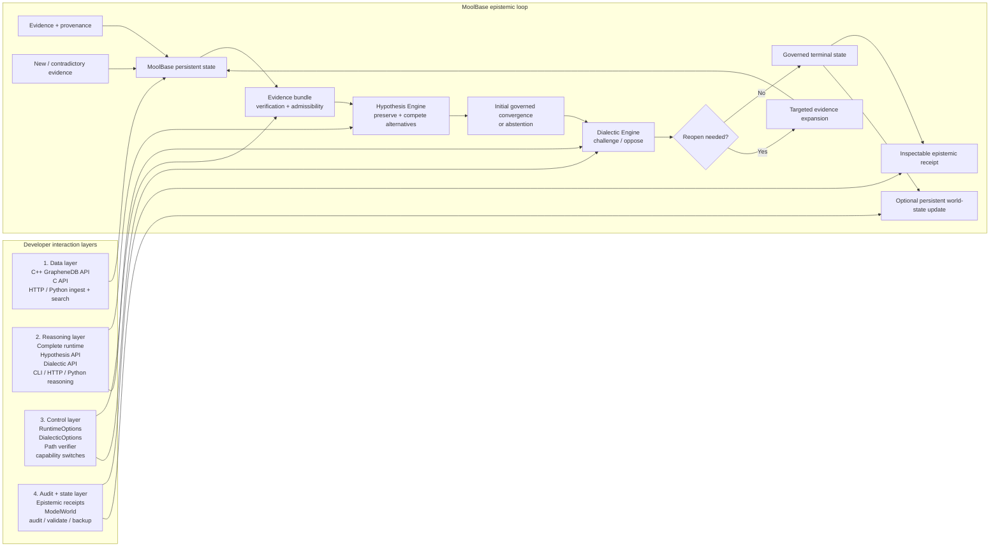

# MoolBase by RASVAI

## The epistemic database for reasoning agents

**Store the evidence. Preserve the alternatives. Know why belief changed.**

MoolBase is an experimental persistent reasoning and agent-memory substrate for AI agents that must operate under **changing, incomplete, duplicated or contradictory evidence**.

Most agent-memory systems are optimized to remember and retrieve useful context. MoolBase is designed for the harder question that comes next:

> **Why does the agent believe this, what evidence supports it, what alternatives remain plausible, and what should happen when new evidence contradicts the current belief?**

MoolBase persists the evidence lineage, competing hypotheses, contradictions, governed decisions and revision trail behind an agent's state — so a system can inspect not only **what** it currently believes, but **why the evidence process did or did not earn convergence**.

> **Naming note:** MoolBase is the provisional public product identity for the project historically developed as **GrapheneDB**. Existing benchmark hashes, receipts, papers, APIs and implementation names retain their historical identity during the migration. See [ADR-0001](docs/adr/0001-moolbase-public-product-identity.md).

---

## Why MoolBase exists

Long-running AI agents increasingly need persistent memory, provenance and revision — not just larger context windows or another similarity-search layer.

A useful reasoning substrate has to cope with cases such as:

- two sources repeat the same underlying claim and should not count as independent evidence;
- a minority hypothesis remains plausible even when one explanation currently scores higher;
- new evidence contradicts something the agent previously accepted;
- the system should **abstain or reopen** instead of silently forcing a conclusion;
- an auditor or another agent needs to reconstruct why a decision was reached;
- the world model must evolve without erasing what was previously believed or why it changed.

MoolBase treats these as data-system concerns rather than prompt-only concerns.

### The core idea — and where developers can interact



This is deliberately a **loop**, not a pipeline. MoolBase can be revisited after a dialectical challenge, targeted recovery or late contradictory evidence. The current runtime first builds and assesses evidence, forms an initial governed convergence (or abstains), then applies opposition. If the challenge requests reopening, the runtime expands evidence again, rebuilds the bundle, reassesses and may emit a revision before reaching a terminal governed state.

#### Developer interaction levels

| Level | What a developer can do today | Main surfaces |
|---|---|---|
| **1. Data layer** | Open the database, ingest nodes/edges/extractions, query vectors/metadata/lattice/causal memory, inspect and validate storage | C++ `GrapheneDB`; limited C API; HTTP + Python client for ingest/search |
| **2. Reasoning layer** | Generate competing hypotheses, run governed reasoning, invoke dialectic reasoning, obtain status/confidence/evidence and revision events | C++ `HypoKoshEngine`; C++ `CompleteHypoKoshRuntime`; CLI; HTTP/Python hypothesis and dialectic endpoints |
| **3. Control layer** | Configure retrieval/reasoning bounds, enable or disable Hypothesis/Dialectic capabilities, supply a path verifier, tune bounded reopening/recovery behaviour | C++ `RuntimeOptions`, `DialecticOptions`, `PathVerifier` |
| **4. Audit + state layer** | Build durable epistemic receipts, inspect event sequences, persist/audit world-state updates, validate provenance, checkpoint or back up the store | `CompactEpistemicReceipt`; `ModelWorld`; HTTP/Python admin and validation surfaces |

A developer therefore does **not** need to use the entire stack. They can use MoolBase as:

- a persistent evidence/provenance database;
- a hypothesis-generation layer;
- a full governed reasoning runtime;
- a dialectical challenge/reopen mechanism;
- an audit/receipt layer around another agent system.

The receipt records the observable epistemic event sequence — for example `HypothesisSet → Decision → Challenge → Reopen → Revision → Terminal` — rather than persisting private model chain-of-thought.

The historical implementation names are **GrapheneDB**, **HypoKosh** and **Dialectical Model Worlds (DWM)** respectively.

For the longer technical argument, read [Agent memory is not enough](docs/articles/agent-memory-is-not-enough.md).

---

## MoolBase vs retrieval-only memory

MoolBase is not intended to replace every vector database, graph database or agent-memory service. It focuses on a different layer of the problem.

| System focus | Typical question |
|---|---|
| Vector / semantic retrieval | “What stored information is similar to this query?” |
| Agent memory | “What should this agent remember and retrieve later?” |
| Knowledge graph | “What entities and relationships are represented?” |
| **MoolBase** | **“What should the agent believe given the evidence process, and why did that belief change?”** |

MoolBase combines graph retrieval with provenance, evidence-family/dependency handling, contradiction visibility, competing hypotheses, bounded reopening and governed decision states.

---

## Start with the proof, not the pitch

The fastest way to understand MoolBase is to reproduce the current epistemic mechanism from a clean checkout.

```bash
git clone https://github.com/rastogivaibhav/graphenedb_v1.git
cd graphenedb_v1
python3 scripts/run_flagship_perturbations_v1.py
```

This command rebuilds and replays the frozen flagship proof, verifies its canonical mechanism receipt, runs five pre-registered adversarial perturbations and writes machine-readable receipts.

**No hosted model or API key is required.**

Canonical flagship mechanism receipt:

```text
36ca5817494325870b81dbe96c261086c13ff09e040b7604242bcbf92d6dedef
```

See [Independent flagship reproduction](docs/INDEPENDENT_REPRODUCTION.md) for expected hashes, interpretation, claim boundaries and instructions for submitting an independent reproduction or critique.

We explicitly want external engineers and researchers to **reproduce, break and challenge the claims** rather than treat internal tests as validation.

---

## What MoolBase can do today

### Evidence and provenance

- deterministic immutable `FiberBundle` schema v2;
- separate graph-route, source, evidence-family and derivation lineage;
- duplicate-path removal and correlated-evidence grouping;
- support, opposition and noise represented as distinct epistemic roles;
- temporal, provenance and critical-edge completeness checks.

### Competing hypotheses

- preserves minority/counter hypotheses rather than silently collapsing them;
- separates hypothesis competition from dialectical challenge;
- supports governed outcomes including:
  - `resolved`
  - `provisionally_resolved`
  - `contested`
  - `evidence_required`
  - `abstain`
  - `speculative`

### Contradiction and reopening

- material contradiction can block convergence;
- frontier-aware bounded recovery can retrieve missing evidence;
- challenge/reopen mechanisms can trigger targeted secondary research;
- no-silent-promotion enforcement prevents unsupported world-state promotion.

### Decision provenance

- compact deterministic epistemic receipts;
- selected path and evidence references;
- source and derivation lineage;
- governed status and residual uncertainty;
- persistent checksummed model-world ledger and audit history.

### Developer surfaces

- embedded C++ API;
- C API for lower-level storage surfaces;
- CLI;
- authenticated POSIX HTTP server;
- installable CMake package;
- reproducible CI/release evidence.

---

## Five-minute developer start

The currently packaged developer alpha remains under the historical GrapheneDB release identity while the MoolBase migration is completed.

```bash
git clone --branch release/v0.6.0-alpha.1 --single-branch \
  https://github.com/rastogivaibhav/graphenedb_v1.git
cd graphenedb_v1
bash scripts/developer_quickstart.sh
```

Windows PowerShell:

```powershell
.\scripts\developer_quickstart.ps1
```

Verify installation from an unrelated CMake project:

```bash
bash scripts/verify_developer_install.sh
```

Run the exact-head release gate:

```bash
bash scripts/run_alpha_release_gate.sh
```

See [Developer quickstart](docs/DEVELOPER_QUICKSTART.md) for prerequisites and expected output.

---

## How the reasoning runtime works

```text
Graph expansion
→ immutable evidence bundle
→ semantic-verifier boundary
→ epistemic admissibility
→ stability critic
→ hypothesis convergence
→ dialectical challenge
→ targeted recovery when evidence is incomplete
→ optional opposition-led research
→ governed projection
→ compact epistemic receipt
→ persistent world-state event
```

Recursive search is **not always on**. The runtime performs bounded reasoning and re-expands only when the current evidence exposes a graph-searchable defect such as a missing hop, insufficient independent evidence, contradiction, temporal mismatch, retrieval noise or a relevant minority path.

This is intended to make revision **observable and testable**, rather than hiding additional search behind an opaque reasoning step.

---

## Epistemic receipts

The complete reasoning bundle is normally an ephemeral workspace. MoolBase can persist a compact content-addressed receipt instead.

Current historical C++ API:

```cpp
#include "graphene/epistemic_receipt.hpp"

HypoKoshRuntimeResult result = runtime.reason(query, signature, options);
CompactEpistemicReceipt receipt =
    build_compact_epistemic_receipt(result);
```

The receipt retains selected path IDs, evidence/source/derivation lineage, bundle references, governed status, energy, semantic-verification state and residual uncertainty without copying source documents or every recursive-cycle state.

See [Reasoning modes and receipts](docs/REASONING_MODES_AND_RECEIPTS.md).

---

## Current evidence

### Controlled intervention benchmark

Across six difficult evidence-recovery families:

| Policy | Final accuracy | Mean cycles | Mean visited states |
|---|---:|---:|---:|
| No cycle | 0.0% | 0.00 | 2.67 |
| Old unchanged-bundle stop | 66.7% | 1.83 | 10.17 |
| Frontier-aware targeted | 100.0% | 3.00 | 16.00 |
| Forced broad retrieval | 83.3% | 3.00 | 34.00 |

**Important:** this is a controlled mechanism benchmark. It is **not** evidence of general semantic truth, universal reasoning superiority or public-dataset end-to-end accuracy.

The current lab programme is separately preregistering and implementing an architecture ablation that isolates:

```text
B0  baseline
G0  MoolBase / Graphene persistence only
G1  + Hypothesis Engine
G2  + Dialectic Engine
```

The score lock remains closed until the production execution boundaries and clean UNSCORED runs are proven.

See [Lab & Market Program — Proof → Publish → Adoption](https://github.com/rastogivaibhav/graphenedb_v1/issues/25).

---

## Build from source

For a local C++ build with tests:

```bash
cmake -S . -B build \
  -DCMAKE_BUILD_TYPE=Release \
  -DGRAPHENEDB_BUILD_TESTS=ON \
  -DGRAPHENEDB_BUILD_SERVER=OFF \
  -DGRAPHENEDB_BUILD_BENCH=ON \
  -DGRAPHENEDB_BUILD_EXAMPLES=ON

cmake --build build -j2
ctest --test-dir build --output-on-failure
```

The historical `GRAPHENEDB_*` build options and namespaces remain intentionally stable during the naming transition.

---

## CLI

```bash
./build/graphenedb_cli reason /tmp/graphenedb 16 <comma-vector> <signature> \
  --mode empirical --max-rounds 3 --json
```

The result includes governed status, bundle hashes, initial/final energy, final regime and certificate flags.

---

## HTTP runtime

```bash
export GRAPHENEDB_API_KEY='development-key'

./build/graphenedb_server /tmp/graphenedb 16 8080 \
  --bind-address 127.0.0.1 \
  --workers 2 \
  --queue-capacity 32
```

Invoke:

```text
POST /v1/reason/runtime
X-API-Key: <your key>
```

The POSIX HTTP server is currently unsupported on Windows. The embedded library is the preferred first-run path.

---

## Reproducibility and distribution

The current repository distribution is hardened around reproducibility and provenance:

- Apache License 2.0;
- `NOTICE` and third-party distribution boundaries;
- DCO 1.1 contribution provenance;
- exact-source-commit release manifests;
- SHA-256 artifact validation;
- SPDX 2.3 SBOM generation;
- GitHub/Sigstore provenance-attestation support for release runs.

See [Distribution security and license verification](docs/DISTRIBUTION_SECURITY.md).

---

## Maturity

**Experimental developer alpha for research and controlled pilots.**

MoolBase is **not enterprise GA** and is **not a semantic truth engine**.

Current internal gates cover clean builds, tests, installed-package consumption, fuzz/sanitizer smoke, release-candidate packaging, controlled intervention evidence and paper/system conformance.

Internal CI does **not** establish independent validation.

The programme will not claim success until:

1. the core thesis has reproducible empirical support with limitations disclosed;
2. an independent engineer can install, run and understand the flagship workflow without founder hand-holding;
3. outsiders have reproduced, critiqued or used the system;
4. MoolBase receives independent technical attention and real usage beyond the founder's network.

---

## Honest limitations

- the G0/G1/G2 production architecture ablation is still being completed;
- no global asymptotic-stability proof exists for an unbounded model world;
- structural stability is not semantic truth;
- generic parsing is bounded and is not general natural-language understanding;
- the model world is a local bounded ledger, not a distributed autonomous scheduler;
- public API surfaces are still being consolidated around one flagship reasoning contract;
- long-duration production-hardware soak remains open;
- naming/package/domain migration from GrapheneDB to MoolBase is not yet final;
- independent reproductions and adopters are still required before GA claims.

---

## Research and implementation lineage

The project is intentionally preserving the names under which its scientific artifacts were created.

| Public direction | Historical / implementation name |
|---|---|
| **MoolBase** | GrapheneDB |
| **Hypothesis Engine** | HypoKosh |
| **Dialectic Engine** | Dialectical Model Worlds (DWM) |

Frozen benchmark files, hashes, receipts, commit history and papers are not renamed merely for branding consistency.

See [ADR-0001 — MoolBase public product identity](docs/adr/0001-moolbase-public-product-identity.md).

---

## Main implementation areas

```text
include/graphene/fiber_bundle.hpp
include/graphene/path_verifier.hpp
include/graphene/epistemic_control.hpp
include/graphene/stability_critic.hpp
include/graphene/hypokosh_runtime.hpp
include/graphene/epistemic_receipt.hpp

src/fiber_bundle.cpp
src/epistemic_control.cpp
src/stability_critic.cpp
src/dialectic.cpp
src/hypokosh_runtime.cpp
src/epistemic_receipt.cpp
```

---

## Who should try MoolBase?

MoolBase is currently most relevant if you are building or researching:

- long-running AI agents with persistent memory;
- agent memory with provenance and auditability;
- reasoning systems that must preserve competing hypotheses;
- AI systems operating under contradictory or changing evidence;
- decision provenance and inspectable reasoning traces;
- governed agentic systems where abstention and revision matter;
- research into belief state, epistemic state or machine-native decision infrastructure.

If your requirement is only fast semantic similarity search, a conventional vector store will usually be the simpler tool.

---

## Contribute, reproduce, or challenge it

The most valuable contribution right now is not another feature.

It is an **independent reproduction, failure case, adversarial scenario or credible criticism**.

Start with:

- [Independent reproduction guide](docs/INDEPENDENT_REPRODUCTION.md)
- [Developer quickstart](docs/DEVELOPER_QUICKSTART.md)
- [Lab & Market Program](https://github.com/rastogivaibhav/graphenedb_v1/issues/25)
- [Public reproduction request](https://github.com/rastogivaibhav/graphenedb_v1/issues/38)
- [Contributing](CONTRIBUTING.md)

---

## License

Apache-2.0. See [LICENSE](LICENSE), [NOTICE](NOTICE), [THIRD_PARTY_NOTICES.md](THIRD_PARTY_NOTICES.md) and [Distribution security](docs/DISTRIBUTION_SECURITY.md).

---

**MoolBase by RASVAI**

*Store the evidence. Preserve the alternatives. Know why belief changed.*
