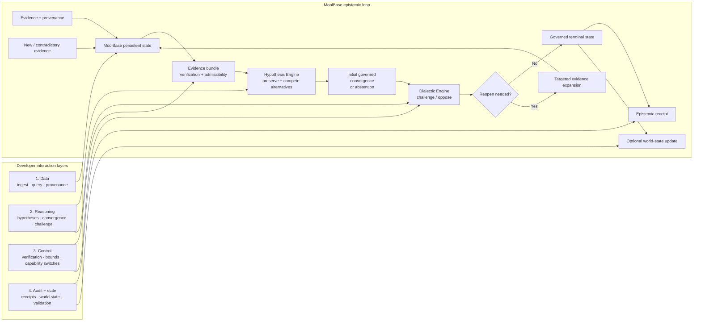

# MoolBase by RASVAI

**The epistemic database for reasoning agents.**

[](https://github.com/rastogivaibhav/graphenedb_v1/actions/workflows/ci.yml)
[](https://github.com/rastogivaibhav/graphenedb_v1/actions/workflows/alpha-release-gate.yml)
[](LICENSE)

**Store the evidence. Preserve the alternatives. Know why belief changed.**

MoolBase is an experimental persistent reasoning and agent-memory substrate for AI agents operating under **changing, incomplete, duplicated or contradictory evidence**.

Most memory systems answer:

> What should the agent remember?

MoolBase is built around the harder question:

> **Why should the agent believe this, what evidence supports it, what alternatives remain plausible, and what should happen when new evidence contradicts the current belief?**

**Status:** developer alpha for research and controlled pilots. Not enterprise GA and not a semantic truth engine.

> **Naming:** MoolBase is the provisional public product identity for the system historically developed as **GrapheneDB**. Existing APIs, benchmark hashes, receipts, papers and implementation identifiers retain their historical names during migration. See [ADR-0001](docs/adr/0001-moolbase-public-product-identity.md).

**Start here:** [Run the proof](#run-the-proof) · [Architecture](#architecture) · [Developer interaction levels](#developer-interaction-levels) · [Build](#build-from-source) · [Docs](#documentation) · [Contribute](#contribute-or-challenge-it)

---

## Why MoolBase

Long-running AI agents need more than retrieval and larger context windows.

MoolBase is designed to preserve:

- **evidence provenance** — where a claim came from and whether multiple signals are truly independent;
- **competing hypotheses** — alternatives stay visible instead of disappearing when one currently ranks higher;
- **contradiction** — conflicting evidence remains part of state rather than being silently overwritten;
- **belief revision** — late evidence can reopen a prior decision;
- **decision provenance** — a durable receipt records why a governed state was reached or changed.

| System focus | Typical question |
|---|---|
| Vector / semantic retrieval | What stored information is similar to this query? |
| Agent memory | What should this agent remember and retrieve later? |
| Knowledge graph | What entities and relationships are represented? |
| **MoolBase** | **What should the agent believe given the evidence process, and why did that belief change?** |

If you only need fast semantic similarity search, a conventional vector store will usually be the simpler tool.

---

## Run the proof

The fastest way to understand the current mechanism is to reproduce it from a clean checkout:

```bash
git clone https://github.com/rastogivaibhav/graphenedb_v1.git
cd graphenedb_v1
python3 scripts/run_flagship_perturbations_v1.py
```

This rebuilds and replays the frozen flagship proof, verifies its canonical mechanism receipt, runs five pre-registered adversarial perturbations and writes machine-readable receipts.

**No hosted model or API key is required.**

Canonical flagship mechanism receipt:

```text
36ca5817494325870b81dbe96c261086c13ff09e040b7604242bcbf92d6dedef
```

See [Independent flagship reproduction](docs/INDEPENDENT_REPRODUCTION.md) for expected hashes, interpretation, claim boundaries and instructions for submitting an external reproduction or critique.

---

## Architecture

MoolBase is a **feedback loop**, not a linear reasoning pipeline.



The runtime first builds and assesses evidence, forms an initial governed convergence (or abstains), then applies opposition. If the challenge requests reopening, MoolBase performs bounded targeted expansion, rebuilds the evidence bundle, reassesses it and may emit a revision before reaching a terminal governed state.

The observable event sequence can include:

```text
HypothesisSet → Decision → Challenge → Reopen → Revision → Terminal
```

This is **decision provenance**, not persisted private model chain-of-thought.

### Developer interaction levels

| Level | What you can do | Current surfaces |
|---|---|---|
| **1. Data** | Open the store, ingest evidence, query vectors/metadata/lattice/causal memory, inspect and validate | C++ `GrapheneDB`; limited C API; HTTP/Python ingest + search |
| **2. Reasoning** | Generate hypotheses, run governed reasoning, invoke dialectic challenge/reopen | C++ `HypoKoshEngine`; `CompleteHypoKoshRuntime`; CLI; HTTP/Python reasoning |
| **3. Control** | Configure bounds, verification, capability switches and bounded reopening/recovery | `RuntimeOptions`; `DialecticOptions`; `PathVerifier` |
| **4. Audit + state** | Build receipts, inspect event history, persist/audit world state, validate provenance and back up | `CompactEpistemicReceipt`; `ModelWorld`; admin/validation surfaces |

You do **not** have to adopt the whole stack. MoolBase can be used as:

- a persistent evidence/provenance database;
- a competing-hypothesis layer;
- a full governed reasoning runtime;
- a challenge/reopen layer around an existing agent;
- an epistemic receipt and audit layer.

Historical implementation names remain **GrapheneDB**, **HypoKosh** and **Dialectical Model Worlds (DWM)**.

---

## What works today

### Evidence and provenance
- immutable evidence bundles with source/evidence-family/derivation lineage;
- duplicate-path removal and correlated-evidence grouping;
- temporal, provenance and critical-edge completeness checks;
- support, opposition and noise represented as distinct epistemic roles.

### Governed reasoning
- competing hypotheses remain visible;
- contradiction can block convergence;
- bounded targeted recovery can retrieve missing evidence;
- opposition can trigger reopen/re-expansion;
- governed outcomes include `resolved`, `provisionally_resolved`, `contested`, `evidence_required`, `abstain` and `speculative`.

### Decision provenance
- deterministic compact epistemic receipts;
- selected path/evidence/source lineage;
- residual uncertainty and semantic-verification state;
- persistent checksummed model-world events;
- no-silent-promotion enforcement.

### Developer surfaces
- embedded C++ API;
- limited C API;
- CLI;
- authenticated POSIX HTTP server;
- dependency-free Python HTTP client;
- installable CMake package.

---

## Build from source

For a local C++ build with tests:

```bash
cmake -S . -B build \
  -DCMAKE_BUILD_TYPE=Release \
  -DGRAPHENEDB_BUILD_TESTS=ON \
  -DGRAPHENEDB_BUILD_SERVER=OFF \
  -DGRAPHENEDB_BUILD_BENCH=ON \
  -DGRAPHENEDB_BUILD_EXAMPLES=ON

cmake --build build -j2
ctest --test-dir build --output-on-failure
```

The historical `GRAPHENEDB_*` build options and namespaces remain intentionally stable during the naming transition.

For the packaged historical alpha quickstart, see [Developer quickstart](docs/DEVELOPER_QUICKSTART.md).

---

## Minimal API examples

### C++ storage

```cpp
#include "graphene/db.hpp"

graphene::GrapheneDB db;
graphene::DBOptions options;
options.dimension = 16;

auto status = db.open("/tmp/moolbase", options);
```

### C++ governed reasoning

```cpp
#include "graphene/hypokosh_runtime.hpp"

graphene::CompleteHypoKoshRuntime runtime(db);
graphene::RuntimeOptions options;

auto result = runtime.reason(query, signature, options);
```

### Python / HTTP client

```python
from graphenedb_client import GrapheneDBClient

client = GrapheneDBClient(api_key="development-key")
result = client.reason_hypokosh("What best explains the evidence?")
print(result.data)
```

The Python client currently exposes HTTP pilot surfaces; the C++ API remains the richest integration surface.

---

## Evidence and validation

The project follows a proof-first programme rather than treating internal CI as external validation.

Current reproducibility includes:

- frozen flagship proof + adversarial perturbations;
- exact-head CI and alpha-release gates;
- controlled intervention benchmarks;
- paper/system conformance checks;
- installable-package consumer tests;
- distribution integrity, checksums and SPDX 2.3 SBOM generation.

The current scientific programme is implementing an architecture ablation:

```text
B0  baseline
G0  MoolBase persistence only
G1  + Hypothesis Engine
G2  + Dialectic Engine
```

The score lock remains closed until the production execution boundaries and clean UNSCORED runs are proven.

See [MoolBase Lab & Market Program](https://github.com/rastogivaibhav/graphenedb_v1/issues/25) for the governing evidence and adoption criteria.

---

## Maturity and limitations

**Developer alpha.** Current limitations include:

- G0/G1/G2 production ablation is still being completed;
- structural stability is not semantic truth;
- no global asymptotic-stability proof exists for an unbounded model world;
- generic parsing is bounded and is not general natural-language understanding;
- public API surfaces still need further consolidation;
- long-duration production-hardware soak remains open;
- MoolBase domain/package migration is not final;
- independent reproductions and adopters are still required before GA claims.

---

## Documentation

- [Developer quickstart](docs/DEVELOPER_QUICKSTART.md)
- [Independent reproduction guide](docs/INDEPENDENT_REPRODUCTION.md)
- [Reasoning modes and receipts](docs/REASONING_MODES_AND_RECEIPTS.md)
- [Distribution security](docs/DISTRIBUTION_SECURITY.md)
- [Naming ADR — MoolBase public product identity](docs/adr/0001-moolbase-public-product-identity.md)
- [Agent Memory Is Not Enough](docs/articles/agent-memory-is-not-enough.md)
- [Changelog](CHANGELOG.md)
- [Support](SUPPORT.md)
- [Code of Conduct](CODE_OF_CONDUCT.md)

---

## Contribute or challenge it

The most valuable contribution right now is an **independent reproduction, failure case, adversarial scenario or credible criticism**.

- Read [CONTRIBUTING.md](CONTRIBUTING.md) and [CODE_OF_CONDUCT.md](CODE_OF_CONDUCT.md).
- For setup or usage help, see [SUPPORT.md](SUPPORT.md).
- Reproduce the [flagship proof](docs/INDEPENDENT_REPRODUCTION.md).
- Submit a failure case or technical critique through [GitHub Issues](https://github.com/rastogivaibhav/graphenedb_v1/issues).
- See the [public reproduction request](https://github.com/rastogivaibhav/graphenedb_v1/issues/38).

For security vulnerabilities, follow [SECURITY.md](SECURITY.md) rather than opening a public issue.

---

## Citation

If you use MoolBase/GrapheneDB in research, see [CITATION.cff](CITATION.cff).

---

## Maintainer

Maintained by [@rastogivaibhav](https://github.com/rastogivaibhav).

---

## License

Apache-2.0. See [LICENSE](LICENSE), [NOTICE](NOTICE) and [THIRD_PARTY_NOTICES.md](THIRD_PARTY_NOTICES.md).

---

**MoolBase by RASVAI** — *Store the evidence. Preserve the alternatives. Know why belief changed.*
