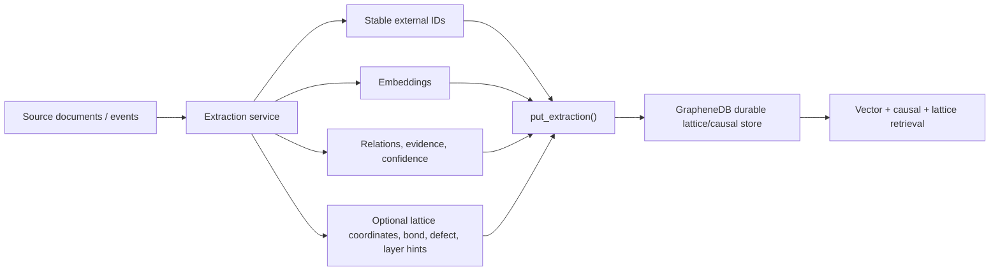

# Next GA Execution Plan

This plan assumes GrapheneDB remains an embedded causal/lattice-memory database, not a distributed Qdrant, Neo4j, SQLite, or material-science simulator replacement.

## Current State

GrapheneDB now has the core pieces needed for a serious controlled pilot:

- Durable node, edge, vector, metadata, snapshot, WAL, checkpoint, backup, validation, and inspect behavior.
- Graphene-inspired lattice coordinates, bond types, defect types, layer support, neighbor validation, and lattice-aware retrieval.
- Batch ingestion and extraction ingestion APIs with source-scoped external IDs and idempotent re-import.
- CLI operator workflows for import, extraction import, neighbors, inspect, validate, compact, and backup.
- Benchmarks for storage/retrieval, extraction ingestion, and vector-only baseline comparison.
- CMake package install/export, external package consumer smoke, C ABI, release manifest, and package hash generation.

The next step is not to keep adding random features. The next step is to prove the system under release-like failure, scale, and consumption paths.

## Phase 1: Freeze The Developer-Preview Contract

Goal: define exactly what is allowed to be stable in `v0.5.0`.

Required decisions:

- Public label: `v0.5.0-rc5` or `v0.5.0-developer-preview`.
- Product boundary: embedded database library plus CLI, no network server, no cluster, no auth service.
- Stable APIs: C++ DB API, CLI import/extract/inspect/validate/backup/compact/neighbors, minimal C ABI.
- Experimental APIs: lattice placement policy, extraction relation schema, vector index policy.
- Unsupported claims: full material-science simulation, SQL database replacement, Qdrant replacement, distributed vector DB.

Exit evidence:

- `README.md` and `docs/GA_READINESS_SCORECARD.md` use the same release label.
- `docs/SAFETY_AND_LIMITATIONS.md` states the embedded security boundary.
- `docs/GRAPHENE_LATTICE_MODEL.md` states where the graphene analogy stops.

## Phase 2: ACID And Failure Testing

Goal: prove single-process embedded DB behavior under realistic crashes and filesystem failures.

Test matrix:

| Area | Test | Expected Result |
|---|---|---|
| Atomicity | Fail WAL append, checkpoint, manifest, and backup writes through failure hooks | Operation returns error and prior durable state remains readable. |
| Consistency | Run validation after normal writes, failed writes, reopen, compact, and backup restore | Validation passes or reports deterministic corruption. |
| Isolation | Concurrent readers during writes, snapshot visibility, deleted node visibility | Readers see stable snapshots; deleted state follows snapshot rules. |
| Durability | Write, close, reopen, process-kill, replay WAL, validate | Committed nodes/edges survive; partial records are ignored or rejected safely. |
| Disk full | Real disk-full volume or quota-backed test path | Write fails cleanly, WAL/manifest state remains recoverable. |
| Permission denied | Remove write permission from WAL/checkpoint/backup targets | Operation fails without corrupting last good state. |
| Corruption | Truncate or mutate manifest/checkpoint/WAL | Open/validate rejects unsupported or corrupt state deterministically. |

Commands to preserve:

```powershell
ctest --test-dir build-release -R "graphenedb_tests|graphenedb_rc5|graphenedb_cli|graphenedb_c_api" --output-on-failure
.\scripts\run_ga_readiness.ps1
```

Exit evidence:

- Full CTest logs.
- Crash/fault matrix report.
- Real disk-full and permission-denied report.
- Reopen and validate output after each failure class.

Enterprise GA requires a 24-hour soak and multi-hour fuzzing run. Developer preview can ship with shorter preserved smoke evidence if the limitation is clearly documented.

The repo now includes `scripts/run_enterprise_ga_campaign.ps1` and `scripts/run_enterprise_ga_campaign.sh` to preserve the heavier validation bundle in `reports/enterprise-ga/<timestamp>/`. Those wrappers do not remove the need for long-duration approved-host runs; they make those runs repeatable and reviewable.

The POSIX CTest target `graphenedb_real_filesystem_failure_tests` covers real read-only WAL reopen failure and denied backup destination behavior. The POSIX CTest target `graphenedb_disk_pressure_tests` uses `RLIMIT_FSIZE` to force a real WAL append failure, then validates and reopens the prior durable state. These tests skip when run as root where the relevant OS behavior may bypass the intended failure model. Windows permission-denied and disk-pressure evidence should use either local ACL/quota-specific harnessing or the deterministic failure hooks until an approved Windows release host is available.

## Phase 3: Storage And Retrieval Performance Testing

Goal: measure insert, storage growth, reopen, retrieval latency, extraction ingest, and lattice propagation cost.

Profiles:

| Profile | Nodes | Dimension | Edges | Metadata | Purpose |
|---|---:|---:|---:|---|---|
| Smoke | 1k-5k | 16-32 | sparse | small | Fast local regression. |
| Preview | 100k | 64-384 | realistic causal/lattice | realistic | Developer-preview evidence. |
| Scale | 1M | 384-1536 | realistic causal/lattice | realistic | Enterprise GA evidence. |

Metrics:

- ingest nodes/sec
- extraction rows/sec
- retrieval p50/p95/p99 latency
- reopen time
- compact time
- backup time
- WAL bytes and data bytes
- memory high-water mark
- vector-only root-hit rate versus causal/lattice root-hit rate
- vector-index recall@k versus exact flat search
- lattice propagation contribution to confidence

Commands:

```powershell
.\scripts\run_rc5_storage_retrieval_bench.sh
.\scripts\run_vector_baseline_bench.ps1 -Incidents 5000 -Queries 500 -Dim 64
.\scripts\run_operator_flow.ps1 -Cli .\build-release\graphenedb_cli.exe
```

The POSIX scripts should be run on Linux CI or a Linux release host. On this Windows machine, Bash/WSL availability is not guaranteed.

Exit evidence:

- `reports/RC5_STORAGE_RETRIEVAL_PERF.md`
- `reports/EXTRACTION_INGEST_PERF.md`
- `reports/VECTOR_BASELINE_COMPARISON.md`
- preserved raw benchmark output for the target hardware profile

The repo now includes `scripts/run_preview_hardware_profile.ps1` and `scripts/run_preview_hardware_profile.sh` to preserve one benchmark bundle in `reports/preview-hardware/<timestamp>/`. That wrapper is the intended reviewer-facing artifact for developer-preview performance publication.

The large stress executables now also use extraction-shaped, lattice-aware workloads rather than only flat node inserts. The 100k wrapper defaults to `16667` incident motifs of six nodes each, and the 1M wrapper defaults to richer 64-dimensional vectors. That closes the "harness realism" gap, but not the enterprise-evidence gap. Enterprise evidence still requires approved-host preserved runs at target dimensions, with a practical floor of `384` for the 100k profile and `768` for the 1M profile before claiming enterprise-scale performance.

To reduce operator error during that final step, the repo now includes target-scale preset wrappers: `scripts/run_target_scale_enterprise_profile.ps1` and `scripts/run_target_scale_enterprise_profile.sh`. They package the approved-host enterprise defaults into one command while still allowing smaller local overrides for smoke validation.

## Phase 4: Extraction Boundary

Goal: make extraction a clean upstream service boundary without putting LLM parsing inside the storage engine.

GrapheneDB needs a unique extraction API. It already has the correct first version: `GrapheneDB::put_extraction()`.

GrapheneDB does not need the database core to become an extractor service. The extractor should be a separate service or library because it has different dependencies, failure modes, and scaling needs.

Recommended architecture:



Extractor responsibilities:

- chunking
- provenance
- stable external ID generation
- embedding generation
- relation extraction
- confidence and evidence metadata
- optional lattice placement hints
- retry-safe batching

Database responsibilities:

- validate dimensions
- validate lattice coordinates and bonds
- enforce source-scoped identity
- suppress duplicate nodes and relations
- durably commit nodes/edges in one batch
- provide retrieval over vector, causal, temporal, and lattice signals

Unique algorithm need:

- Short term: deterministic semantic row/hex placement is sufficient for developer preview.
- Medium term: add a lattice-aware placement optimizer that minimizes invalid bonds, keeps incident-local neighborhoods compact, and penalizes defect/boundary crossings.
- Long term: add learned or domain-specific placement outside the DB, then pass explicit coordinates and bonds into `put_extraction()`.

The algorithm should optimize memory topology. It should not claim carbon physics.

## Phase 5: Packaging And Distribution

Goal: prove downstream users can install and consume the library without repo-local assumptions.

Required gates:

- CMake configure/build/install on Windows and Linux.
- `find_package(GrapheneDB CONFIG REQUIRED)` consumer smoke.
- CLI available in install package when enabled.
- Public headers installed, including C ABI.
- Release archive generated with `.sha256` and `.manifest.json`.
- Package unpacked into a clean directory and verified.

Commands:

```powershell
.\scripts\verify_package_install.ps1
.\scripts\package_release_install.ps1
```

Exit evidence:

- package consumer build log
- package manifest
- package SHA-256 sidecar
- installed file inventory

## Phase 6: Final Release Gates

Developer preview gates:

- All unit and CLI tests pass.
- Package consumer smoke passes.
- Operator flow passes.
- Preview performance profile is published.
- Known limitations are documented.
- Release archive has manifest and hash.

Enterprise GA gates:

- 24-hour soak passes.
- Multi-hour fuzzing passes with preserved corpus.
- Approved-host 100k/1M rich-workload profiles pass target SLOs at release dimensions (`100k >= 384`, `1M >= 768`).
- Real disk-full and permission-denied failure tests pass.
- Production vector index decision is made and tested.
- Release signing and license review are complete.
- Recovery rehearsal is performed on target release hosts.

## Immediate Next Actions

1. Run the focused release validation suite on this machine.
2. Run the full GA readiness harness on an approved host that does not block newly built executables.
3. Produce a developer-preview evidence bundle from `reports/`, CTest output, benchmark output, package manifest, and operator-flow logs.
4. Treat `put_extraction()` schema version 1 as the stable v0.5 ingestion contract; future incompatible changes must use a new schema version.
5. Run the recovery rehearsal on every release host and preserve the source/restore validation logs.
6. Keep the extractor as a separate service/library and use `put_extraction()` as the durable API boundary.

The evidence bundle should be produced with:

```powershell
.\scripts\collect_ga_evidence.ps1 -Archive
```

or:

```bash
scripts/collect_ga_evidence.sh
```

The reviewable bundle path now defaults to a labeled `release-candidate-smoke` run and preserves the requested/resolved vector-index selection for the packaged GA-readiness, preview, and release-candidate benchmark legs. That keeps the archive readable when comparing local smokes against the target-host enterprise evidence that still remains outstanding.
