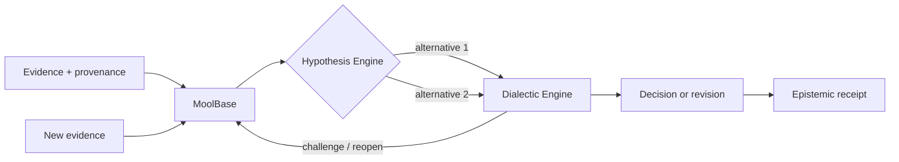

# Agent Memory Is Not Enough

## Why reasoning agents need evidence, competing hypotheses and belief revision

Long-running AI agents are quickly becoming stateful systems.

They remember users, retrieve prior conversations, cache plans, build knowledge graphs, keep task history and carry context across sessions. This is important progress. But persistent memory alone does not solve the harder reasoning problem.

A system can remember the wrong thing perfectly.

The deeper question is not only:

> What should the agent remember?

It is also:

> Why should the agent believe it, what evidence supports it, which alternatives remain plausible, and what happens when new evidence contradicts the current state?

That is the problem MoolBase is designed to explore.

---

## Memory retrieval and belief state are different problems

A conventional memory system usually optimizes some combination of:

- storage;
- semantic similarity;
- recency;
- importance;
- graph connectivity;
- summarization;
- retrieval relevance.

Those are useful capabilities. But a reasoning agent also needs to understand the **epistemic status** of what it retrieves.

Imagine three documents all support the same claim.

That may look like three independent pieces of evidence.

But what if all three copied the same original source?

Counting them independently creates false confidence.

Or imagine one hypothesis currently has more support than another.

Should the system delete the weaker hypothesis?

Not necessarily.

The weaker explanation might become the correct one when late evidence arrives.

A useful persistent reasoning system therefore needs more than retrieval. It needs to preserve the structure of how belief was earned.

---

## The four states a reasoning system should not collapse together

A practical agent often needs to distinguish at least four things:

1. **Evidence** — observations, documents, events or claims with provenance.
2. **Hypotheses** — competing explanations of that evidence.
3. **Decisions** — the best governed action or belief given the current evidence.
4. **Revisions** — the reason a previous decision was reopened or changed.

When these are stored as one undifferentiated "memory", important information disappears.

A summary such as:

> "Vendor A caused the outage."

may be useful operationally.

But it does not tell us:

- whether Vendor A was one of several hypotheses;
- whether the supporting events came from independent sources;
- whether contradictory evidence existed;
- whether the conclusion was provisional;
- whether the conclusion was later revised;
- why the revision happened.

That missing structure matters for agents expected to operate autonomously over time.

---

## The MoolBase model

MoolBase treats persistent reasoning state as a data-system concern.



The public architecture is intentionally simple:

- **MoolBase** stores persistent evidence, provenance and epistemic state.
- **Hypothesis Engine** keeps plausible alternatives alive and competes them.
- **Dialectic Engine** challenges the current state, reopens evidence when justified, and supports governed revision.
- **Epistemic receipts** make the decision process inspectable after the fact.

The historical implementation lineage is GrapheneDB, HypoKosh and Dialectical Model Worlds (DWM).

---

## Why competing hypotheses matter

Premature convergence is one of the easiest ways for an agent to become confidently wrong.

Suppose an operations agent observes:

- latency increased after a deployment;
- an application error rate also increased;
- a downstream service shows intermittent failures.

A simplistic system may choose:

> The deployment caused the incident.

That may be reasonable.

But the downstream service remains a plausible alternative.

If the system deletes that alternative after choosing the deployment hypothesis, it has made later correction harder.

The better pattern is:

```text
H1: deployment regression
H2: downstream dependency failure
H3: shared infrastructure issue
```

The system can still act on H1 if the evidence justifies it. The important point is that choosing an action does not require pretending uncertainty has disappeared.

This separation between **decision** and **belief certainty** is central to MoolBase.

---

## Why provenance matters

Provenance is not only an audit feature.

It directly changes reasoning quality.

If five alerts originate from the same underlying telemetry event, they should not necessarily count as five independent confirmations.

Likewise:

- copied reports;
- derivative summaries;
- mirrored data feeds;
- multiple agents quoting the same source

can produce an illusion of consensus.

MoolBase tracks source, evidence-family and derivation lineage so correlated support can remain visible rather than silently inflating confidence.

---

## Why contradiction should be persistent

Many AI systems treat contradiction as a prompt-level inconvenience.

A persistent reasoning substrate should treat contradiction as state.

Consider:

```text
09:00  Evidence supports H1
09:05  H1 becomes provisional decision
09:12  New evidence contradicts H1
09:13  H2 gains support
09:14  Previous decision is reopened
09:16  H2 becomes the supported world state
```

The useful artifact is not only the final answer.

The useful artifact is the entire revision path.

That path lets another engineer, agent or auditor understand:

- what changed;
- what new evidence mattered;
- which earlier assumptions were invalidated;
- whether the system reopened for a legitimate reason;
- whether a previous decision was silently overwritten.

---

## Decision provenance is different from chain-of-thought

MoolBase is not intended to persist private model chain-of-thought.

The goal is to persist **machine-readable decision provenance**:

- evidence references;
- source lineage;
- hypothesis state;
- contradiction state;
- governed status;
- selected paths;
- residual uncertainty;
- revision events;
- stable receipts.

That is a different abstraction.

It is closer to a durable transaction record for belief change than a transcript of hidden model reasoning.

---

## A concrete failure pattern

The scenario MoolBase is trying to make observable looks like this:

```text
Initial evidence
      ↓
H1 appears strongest
      ↓
provisional decision
      ↓
H2 remains plausible
      ↓
new contradictory evidence
      ↓
reopen
      ↓
additional targeted evidence
      ↓
belief revision
      ↓
receipt showing what changed and why
```

A memory system can store every individual step.

An epistemic database should also preserve their **relationship**.

---

## What MoolBase is not

MoolBase is not intended to claim that:

- structural consistency equals semantic truth;
- every decision can be made deterministic;
- a graph database automatically solves reasoning;
- persistent memory eliminates hallucination;
- one benchmark proves universal superiority.

The current system is an experimental developer alpha.

Its scientific programme is explicitly testing whether the architecture improves:

1. truth acquisition;
2. resistance to false convergence;
3. explainable revision of belief.

The current architecture-ablation work separates:

```text
B0  baseline
G0  MoolBase persistence
G1  + Hypothesis Engine
G2  + Dialectic Engine
```

The score-bearing evaluation remains locked until those production execution boundaries are cleanly implemented and reproduced in UNSCORED runs.

---

## Why this may matter for agent infrastructure

As AI agents become longer-lived, the infrastructure question changes.

The early question was:

> How do I give the model context?

Then:

> How do I give the agent memory?

The next question may be:

> How do I maintain a persistent, inspectable belief state that can survive contradiction and revision?

That requires different primitives.

Not just vectors.

Not just retrieval.

Not just chat history.

Persistent evidence. Alternative hypotheses. Provenance. Contradiction. Governed revision.

That is the space MoolBase is exploring.

---

## Reproduce the current mechanism

The project intentionally asks people to test the mechanism rather than trust the positioning.

From a clean checkout:

```bash
git clone https://github.com/rastogivaibhav/graphenedb_v1.git
cd graphenedb_v1
python3 scripts/run_flagship_perturbations_v1.py
```

No hosted model or API key is required.

See:

- [README](../../README.md)
- [Independent reproduction guide](../INDEPENDENT_REPRODUCTION.md)
- [MoolBase Lab & Market Program](https://github.com/rastogivaibhav/graphenedb_v1/issues/25)
- [Public reproduction request](https://github.com/rastogivaibhav/graphenedb_v1/issues/38)

The most useful external contribution right now is a reproduction, counterexample, failure case or criticism.

---

**MoolBase by RASVAI**

*Store the evidence. Preserve the alternatives. Know why belief changed.*
